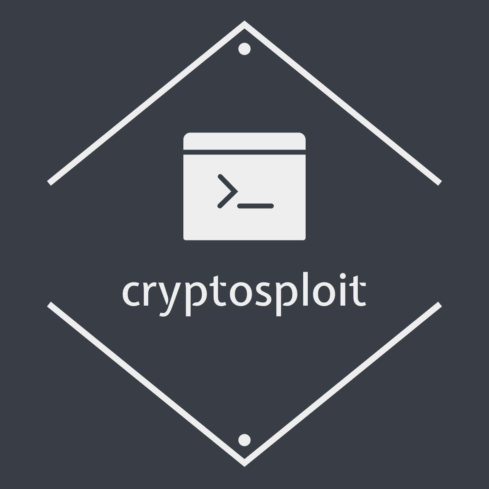

Cryptosploit
===
<br>

<p align="center">

</p>
<br>

<p align="center">
  
  
   

<p>
A decryption/decoding/cracking tool using various modules.

To use it, you need to have basic knowledge of cryptography.
</p>

Table of Contents
---
- [Cryptosploit](#cryptosploit)
  - [Table of Contents](#table-of-contents)
  - [🔨 Installation Guide](#-installation-guide)
  - [🤔 What is this?](#-what-is-this)
  - [🏃‍♀️ Running Cryptosploit](#️-running-cryptosploit)
  - [💻 Modules](#modules)

## 🔨 Installation Guide

We recommend you to install cryptosploit in a **python virtual environment**, but you can also install cryptosploit on the main system.

<br>

### With python virtual environment

```sh
python -m venv venv
source venv/bin/activate
pip install git+https://github.com/SNESEAR/cryptosploit.git --upgrade
deactivate
```

<br>

### On main system with sudo

```sh
sudo pip install git+https://github.com/SNESEAR/cryptosploit.git --upgrade
```

We use `sudo` to allow `setup.py` to add cryptosploit to `/usr/bin`.

<br>

### On main system

Alternatively, you can install cryptosploit without sudo and modify your $PATH.

```sh
pip install git+https://github.com/SNESEAR/cryptosploit.git --upgrade
echo "export PATH=$PATH:~/.local/bin" >> ~/.bashrc
```


🤔 What is this?
---
Cryptosploit is a new module-based cryptographic tool, it designed to become **a tool for automating a lot of routine work with various scripts**. You can use it to solve different cryptographic tasks.

In fact, it is a large library of tools. **You don't need a directory with gigabytes of cryptographic tools**.
You mustn't keep in mind all the flags and modes in the cli tools anymore.
Cryptosploit will do it for you :З


🏃‍♀️ Running Cryptosploit
---
Very simple way of usage:


<br>

Read more about any command
```
crsconsole> help

Documented commands (type help <topic>):
========================================
cd  exit  get  help  run  search  set  shell  unset  use

crsconsole> help search

        Search modules by keyword.
        Example: search rot
        
```
<br>

You can search modules by regular expressions
```
crsconsole> search hash
[>] hashes
hashes.cracker
```
<br>

Then just type use founded.module
```
crsconsole> use hashes.cracker
[>] Module loaded successfully
```
<br>

Get and set module variables
```
crsconsole (hashes.cracker)> get
╒════════════════════╤═════════╤══════════════════════════════════════════════════╕
│ Name               │ Value   │ Description                                      │
╞════════════════════╪═════════╪══════════════════════════════════════════════════╡
│ default_cracker    │ hashcat │ Default program to crack hashes (hashcat/john).  │
│                    │         │  You must install one of these tools.            │
├────────────────────┼─────────┼──────────────────────────────────────────────────┤
│ mode               │ help    │ Operation mode. May be crack/help/advanced.      │
│                    │         │ Just type run. Advanced users can                │
│                    │         │ pass all the arguments in extra_flags            │
├────────────────────┼─────────┼──────────────────────────────────────────────────┤
│ hash_file          │         │ Path to file with hash.                          │
├────────────────────┼─────────┼──────────────────────────────────────────────────┤
│ wordlist           │         │ Path to wordlist.                                │
│                    │         │ For example, '/usr/share/wordlists/rockyou.txt'  │
├────────────────────┼─────────┼──────────────────────────────────────────────────┤
│ identify_hash_type │ true    │ We will try to identify hash type                │
│                    │         │ and pass most possible type in hash_mode         │
│                    │         │ use 'run' again to try next possible type        │
├────────────────────┼─────────┼──────────────────────────────────────────────────┤
│ hash_mode          │         │ Mode of your hash for you program.               │
│                    │         │ For example, '0' (like in hashcat)               │
├────────────────────┼─────────┼──────────────────────────────────────────────────┤
│ extra_flags        │         │ Add your own flags.                              │
│                    │         │ For example, '--save-memory=1 --fork=10'         │
├────────────────────┼─────────┼──────────────────────────────────────────────────┤
│ path_to_binary     │         │ Specify the path to your program.                │
│                    │         │ For example, '/usr/bin/hashcat'                  │
│                    │         │ Must contain hashcat/john                        │
╘════════════════════╧═════════╧══════════════════════════════════════════════════╛
crsconsole (hashes.cracker)> set mode advanced
[>] Setting mode -> advanced
crsconsole (hashes.cracker)> set extra_flags -a 3 -m 0 hash_to_crack ?a?a?a?a?a?a
[>] Setting extra_flags -> -a 3 -m 0 hash_to_crack ?a?a?a?a?a?a
```
<br>

Type run to execute module functionality

```
crsconsole (hashes.cracker)> run
```

💻 [Modules](https://github.com/y73n0k/cryptosploit_modules)
---
As you have already read, this tool is module-based, that's why it is still in development. We want to extend our module's database.

Anybody can write their own module in any programming language and add it to cryptosploit using a very simple and convenient API in python.
Visit our [modules github wiki](https://github.com/y73n0k/cryptosploit_modules/wiki) to get details about module writing.
